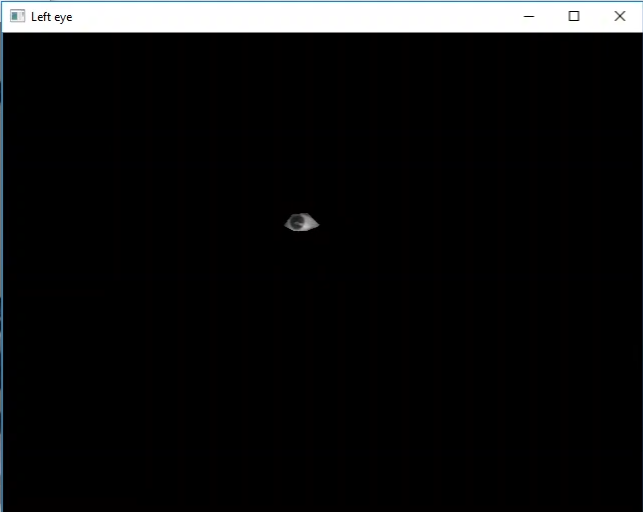
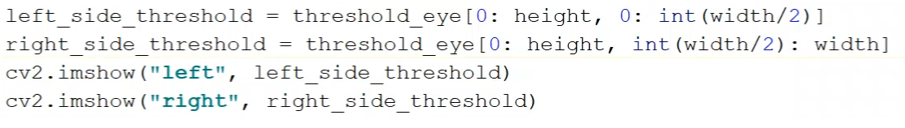

# Eye-Control-Wheelchair

I have create a prototype eye control wheelchair which command the wheetchair using our eye, this prototype is mainly help those person who are physically challange, like paralisis patients. 

### Step involve in this project
1. We need to detect eye region only
2. we need to detect the gage like where we looking, i.e up, bottom, left, right
3. I have a create a small RC car for that i used, motors, L293D motors controller, some led and wire and rasberry pi. 
4. I deploy the eye detection on my car, and map each movement of our eye to motors, such as when we look at left our right motor will speed get decrease, and we look right our left motor get slow down, this why our car turn left and right.

## Detect Eye region
1. `Test the Camera`


2. `Detect the face` using dlib library


3. `Detect the eye`: once the face get detected, detect the eye using `68 facial landmark points` using dlib library.


4. `divide the eye into 2 sagement` draw the horizental line from between `(37+38/2)` and `(41+40)/2`


5. `detect the blinking:` find out length of horizontal line to check if the patitent is sleeping or not.

`put text when it blink`


6. `Draw a polyline` in eye landmark points(36,37,38,39,40,10)


7. `Extract only eye`: show the left eye in new windows


8. `convert the crop eye in binary`


9. `Extract only the eyeball`: remove all the area around the image, using masking 



10. `Divide the threshold into 2 parts`



11. `Divide which side has more while`:
in this we are going to count that which side this image is looking
 


12. `Controll motor according to eye movement`
```python
if left_side_white > right_side_while:
    cv2.putText(frame, "RIGHT", (50,100), font, 2, (0,0,255), 3)
elif left_side_white < right_side_while:
    cv2.putText(frame, "Left", (50,100), font, 2, (0,0,255), 3)
else:
    cv2.putText(frame, "Left", (50,100), font, 2, (0,0,255), 3)
```
```python
import RPi.GPIO as GPIO
import time

# Set up GPIO pin for controlling the motor
motor_pin = 21

GPIO.setmode(GPIO.BCM)
GPIO.setup(motor_pin, GPIO.OUT)

# Define a function to drive the car forward
def drive_forward(duration):
    GPIO.output(motor_pin, GPIO.HIGH)
    time.sleep(duration)
    GPIO.output(motor_pin, GPIO.LOW)

try: 
    while True:
        # Drive the car forward for 0.5 seconds
        drive_forward(0.5)
        
        # Pause for 0.5 seconds
        time.sleep(0.5)
        
except KeyboardInterrupt: 
    print("Keyboard Interrupt:")
    
except:
    print("Some Error")

finally:
    print("Cleaning UP:")
    GPIO.cleanup()
```


